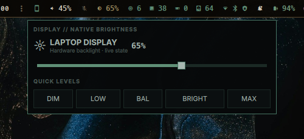
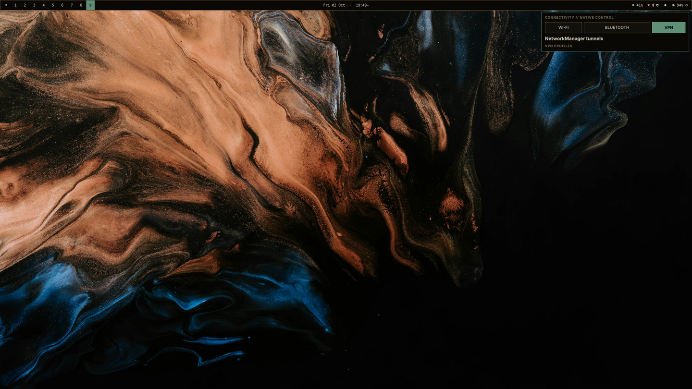

# Nocturne Hyprland

Nocturne is a compact, keyboard-first Hyprland desktop for Ubuntu. It keeps
standard Linux services—NetworkManager, BlueZ, PipeWire, WirePlumber and
power-profiles-daemon—but replaces the custom desktop popovers with one
Qt 6/Wayland layer-shell application.

The result is a sharp neo-hacker shell that still behaves like a familiar
desktop: click an icon to open its card, click it again or click outside to
close it, use the hardware keys normally, and launch ordinary applications as
ordinary tiled windows.

> Status: tested on Ubuntu with Hyprland 0.56+ and Qt 6.6+. The installer
> creates a timestamped backup before touching an existing configuration.

## Highlights

- A single on-demand `nocturne-native` binary for audio, brightness,
  connectivity, power, calendar, world time, Pomodoro, capture and settings.
- No GTK or GNOME dependency in Nocturne's own UI code.
- Live PipeWire app-stream discovery, master volume and output routing.
- A brightness slider that follows hardware-key changes while it is open.
- Wi-Fi, Bluetooth and VPN controls backed by NetworkManager and BlueZ.
- Screenshots and recordings for an area, window or display using
  `grim`, `slurp` and `wf-recorder`.
- Every screenshot is saved to `~/Pictures/Screenshots` and copied as a normal
  `image/png` clipboard item.
- Native multi-monitor bar and application launcher, Mako history, Cliphist,
  Caffeine, media controls, world clocks/weather, power profiles and deep sleep.
- A cached current-location weather row first, followed by the user-defined
  family-city list.
- Lightweight Qt defaults for files, PDFs and calculation without installing a
  complete KDE desktop environment.
- Existing applications, Steam, browsers, VS Code and the user's GNOME session
  remain independent of the Hyprland configuration.

## Screenshots

Project screenshots are captured from an empty workspace and intentionally do
not include browser windows, messages, personal files or terminal history.





## Architecture

```text
Native bar clicks / hotkeys
          │
          ▼
  nocturne-native (Qt Quick)
          │  one local IPC owner; exits when closed
          ├── StatusNotifierWatcher        background application tray
          ├── Mako                         notifications + history
          ├── PipeWire / WirePlumber       audio + per-app streams
          ├── brightnessctl / logind       hardware backlight
          ├── NetworkManager / BlueZ       Wi-Fi, VPN, Bluetooth
          ├── power-profiles-daemon        power modes
          └── grim / slurp / wf-recorder  capture engine
```

The layer-shell window is created at its final monitor and anchor before the
first frame. A transparent Wayland backdrop supplies consistent outside-click
dismissal; the visible card remains interactive. Invoking the same card twice
uses local IPC and toggles the existing instance instead of spawning another
process.

## Install

Start with a working Hyprland session. Review the repository, then run:

```bash
git clone https://github.com/justneeraj12/nocturne-hyprland.git
cd nocturne-hyprland
./install.sh --install-packages
```

If the dependencies are already installed:

```bash
./install.sh
```

The installer:

1. validates required programs;
2. snapshots the current Hyprland-related configuration under `backups/`;
3. builds the native Qt application in release mode;
4. installs user files under `~/.config`, `~/.local/bin` and
   `~/.local/share`; and
5. reloads the live bar when run inside Hyprland.

It does not delete personal files, browser data, Steam data, application
profiles or the GNOME session. Run a source-only check with no live changes:

```bash
./install.sh --dry-run
```

### Supported dependency stack

- Qt 6 Core, Gui, QML, Quick and Network
- KDE LayerShellQt QML module
- Hyprland, Hyprpaper, Hyprlock and Hypridle
- Mako plus KDE and Hyprland XDG portal backends
- PipeWire/WirePlumber, NetworkManager, BlueZ
- grim, slurp, hyprpicker, ImageMagick, wf-recorder and wl-clipboard
- jq, brightnessctl, power-profiles-daemon, Kitty, Cava and btop
- PCManFM-Qt, qpdfview and Qalculate-Qt

Nocturne does not bundle or silently download binary dependencies.

The current-location weather row uses a coarse IP lookup from `ipwho.is`,
caches only city/region, country, coordinates and timezone locally for six
hours, and keeps the last good value while offline. Set
`current_location.enabled` to `false` in `~/.config/nocturne/locations.json`
to disable it; the remaining world-city list continues to work normally.

## Everyday controls

```text
Super + Space       application launcher
Super + Enter       terminal
Super + R           Nocturne Settings
Super + /           complete key guide
Super + Q           close focused window
Super + M           minimize focused window
Super + 1…9         switch workspace
Super + Shift + 1…9 move window to workspace
Super + drag        move/resize floating window
Super + P           power and session card
Print               screenshot / recording toolbar
```

Hardware volume and brightness keys continue to control the real system
devices. The open native cards poll those authoritative values and update
without being closed and reopened.

## Capture behavior

Press `Print`, choose Photo or Video, then choose Area, Window or Display.
Selection happens after the toolbar closes so it never appears inside the
result. Pressing Print briefly uses hyprpicker to obtain the compositor frame,
then replaces it with Nocturne's passive click-through image layer. Open menus
remain visibly frozen, while the toolbar and selector above it receive input
normally. The saved screenshot is cropped from that same private frame, so
neither the toolbar nor the selection border is composited into the image.
Cancelling releases the layer, with a five-minute safety timeout after crashes.

Recordings are saved under `~/Videos/Screenrecords`. While a recording is
active, the native bar REC indicator is visible and opens a Stop + Save action.

## Development

Build only the native shell:

```bash
./scripts/build-native.sh
```

Run the complete local validation:

```bash
./scripts/validate-nocturne.sh
```

The validation builds C++/QML from scratch, checks shell/Python/JSON/Lua,
tests the capture model and local agent, rejects GTK imports in Nocturne's own
UI, validates native bar/tray/notification ownership, and runs patch-hygiene checks.

See [CONTRIBUTING.md](CONTRIBUTING.md) for the contribution workflow and
[SECURITY.md](SECURITY.md) for private vulnerability reporting.

## Recovery

Every application creates `backups/pre-hyprland-<timestamp>`. Existing
machine-local backups are ignored by Git because they may contain private
desktop state.

To restore the original GNOME/macOS appearance without removing Hyprland:

```bash
./restore-gnome-macos.sh
```

For the broader saved user configuration:

```bash
./restore-gnome-backup.sh backups/current-backup
```

The broad restore requires an explicit `RESTORE` confirmation.

System-wide S3/deep-sleep policy is intentionally separate from the user
theme. Review and apply it with:

```bash
pkexec ./configure-deep-sleep.sh
```

## License

Nocturne is released under the [MIT License](LICENSE). Third-party programs
retain their own licenses and are installed from the distribution rather than
vendored here.
