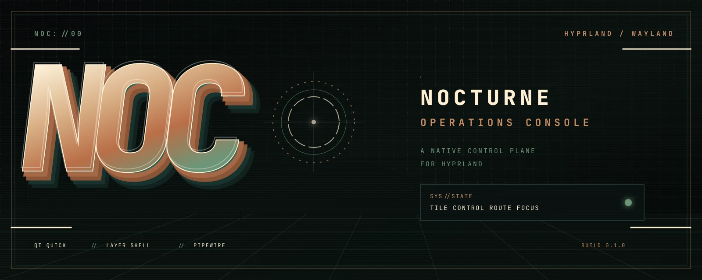
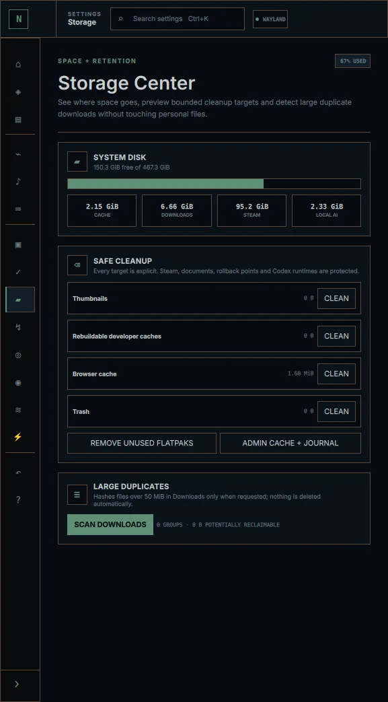
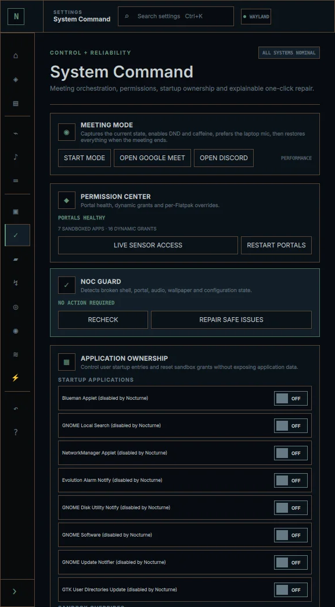
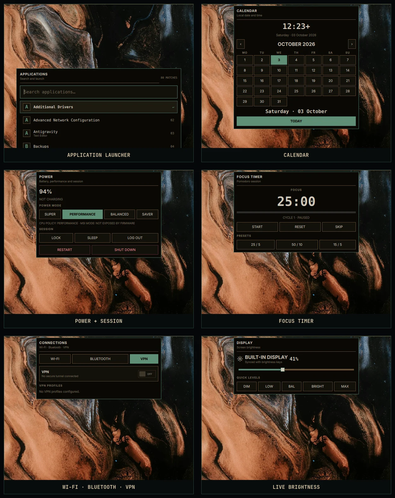
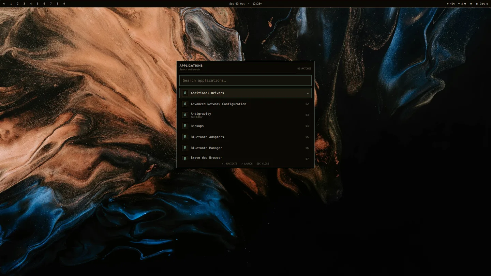
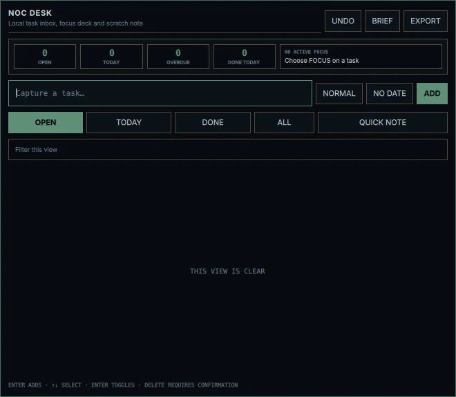
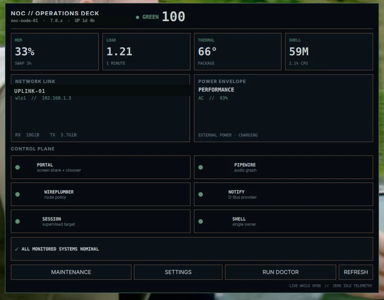
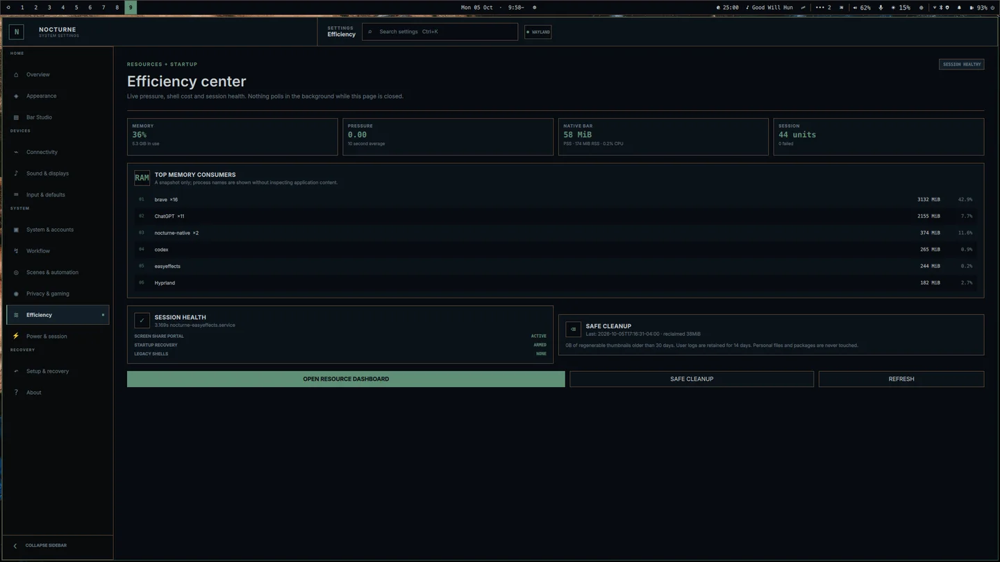
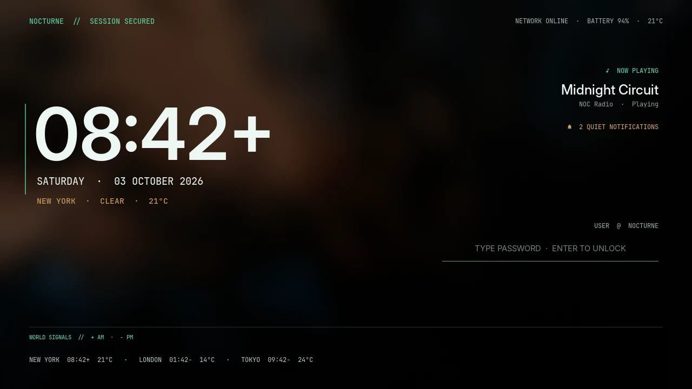

<p align="center">
  
</p>

<h1 align="center">NOC // NOCTURNE</h1>

<p align="center">
  A sharp, native control plane for Hyprland.<br>
  Tiling speed, desktop-grade controls, zero shell-framework sprawl.
</p>

<p align="center">
  <a href="https://github.com/justneeraj12/nocturne-hyprland/actions/workflows/ci.yml"></a>
  <a href="LICENSE"></a>
  
  
  
  
</p>

**NOC**—the **Nocturne Operations Console**—turns a working Hyprland
installation into a coherent desktop without
turning it into a pile of unrelated widgets. Its bar, launcher, settings and
quick controls are built with Qt Quick and Wayland layer shell; the real work
stays with standard Linux services such as NetworkManager, BlueZ, PipeWire and
power-profiles-daemon.

It is designed for people who want a dark, compact rice and still expect
brightness keys, Bluetooth audio, per-app volume, notifications, clipboard
history, power modes, screenshots and screen recording to behave normally.

> **Supported platforms:** Ubuntu 26.04 is hardware-tested; current Arch Linux
> is package-resolved and native-build tested in clean CI. Both require
> Hyprland 0.56+ and Qt 6.6+.

> **NOC 2.0 is in development.** The next generation turns this shell into an
> installable desktop platform with encrypted multi-device continuity, packages,
> transactional updates and a public hardware matrix. Follow the
> [roadmap](ROADMAP.md) or join [Discussions](https://github.com/justneeraj12/nocturne-hyprland/discussions).
> Community testers can start with the [Alpha 2 notes](docs/RELEASE-2.0-ALPHA2.md).

## Current release // 1.3.0

Nocturne 1.3 expands the visual identity without forking critical system behavior. The [release notes](docs/RELEASE-1.3.md) describe the complete lock and terminal system.

- **Ten lock compositions** range from sparse Dead Channel to dense Mainframe while sharing one PAM path;
- **independent treatments** control wallpaper intensity and Operator, 12-hour or 24-hour clock notation;
- **safe previews and migration** preserve the active style and restore previews after one successful unlock;
- **grand and compact NOC marks** give Fastfetch, terminal splits and project screenshots one adaptive identity;
- `nocturne-banner` adds live node state only on demand, with no new resident process.

Read the complete [1.3 release notes](docs/RELEASE-1.3.md).

<p align="center">
  
  
</p>

The images below show the native shell layout on an isolated
workspace. They contain no browser pages, messages, SSIDs, clipboard entries or
personal file names.

## Why this one?

| Difference | What it means in practice |
| --- | --- |
| **One native shell** | A single Qt 6 binary owns the bar and on-demand cards—no Waybar + Eww + AGS stack to theme and debug separately. |
| **Zero-idle popovers** | Audio, network, power and workflow cards exist only while visible, then exit cleanly. |
| **Event-driven state** | Hyprland, PipeWire, MPRIS, NetworkManager, BlueZ, UPower, backlight and tray events update one native shell core without a farm of polling widgets. |
| **Meeting-safe sharing** | Meet and Discord use the trusted Hyprland portal with a compact pinned chooser that stays above the call without disrupting the tiling tree. |
| **Desktop muscle memory** | Click to open, click again or outside to dismiss, hardware keys show compact native OSD feedback, and ordinary apps tile normally. |
| **One searchable control center** | Appearance, hardware, defaults, accounts, automation and recovery live in one responsive Settings app with no dead control-center duplicates. |
| **NOC Operations Deck** | One zero-idle native surface scores node health and exposes live resources, thermals, link, power and control-plane status only while open. |
| **Laptop-first details** | Bluetooth output auto-routing, laptop-mic preference, live brightness sync, caffeine, deep-sleep tooling and power profiles are included. |
| **Reversible by design** | The installer snapshots existing desktop config, diagnostics are read-only, and rollback is a supported path—not an afterthought. |
| **Explainable continuity** | Nocturne can adapt to dock, power, meeting, focus and gaming contexts, but Nocturne Trace tells you why, shows what changed and preserves a direct reversal path. |
| **Local workflow memory** | Desk, Habits and Vault connect tasks, notes, focus blocks, weekly pacing and reusable snippets through private files with no account, cloud dependency or resident workflow daemon. |
| **Deterministic operator input** | Command Center recognizes a small documented control language, previews the exact action and never passes user text to a shell. |
| **Explainable system control** | Storage, permissions, startup, power and recovery expose their real source of truth and keep destructive or privileged actions explicit. |

## The desktop

<p align="center">
  
</p>

<p align="center">
  
  
</p>

<details>
<summary><strong>See the launcher at full size</strong></summary>



</details>

The shell includes:

- a multi-monitor bar with workspaces, media, weather, system state and tray;
- Bar Studio with per-display density and module visibility, icon scale and layout controls;
- Wi-Fi, Bluetooth and VPN control through NetworkManager and BlueZ;
- master volume, output routing and live per-application PipeWire streams;
- hardware-synchronized brightness and microphone state;
- zero-idle hardware camera profiles with busy-client protection and regional anti-flicker;
- a command-center launcher for apps, running windows and safe desktop actions;
- NOC Desk for tasks, due dates, priority, daily focus, quick notes, undo and private Markdown export;
- deterministic Command Center controls for volume, brightness, power, radios, Night Shift, focus and timer setup;
- a nine-workspace overview plus restorable desktop and audio scenes;
- launcher favorites, recent apps, local file search and inline calculations;
- searchable notification history, timed focus modes, clipboard history, minimized apps and a DBusMenu-aware background-app switcher;
- sensitive clipboard filtering, automatic expiry and private pinned text;
- per-app timed notification muting, grouped alerts and verification-code copying;
- live privacy and gaming dashboards with on-demand sensor/GPU inspection;
- a live NOC Operations Deck with node health, resource, thermal, network, power and service telemetry;
- a red, live screen-sharing indicator with state-aware microphone, camera and portal capture privacy reporting;
- an on-demand Efficiency Center with memory pressure, shell cost, startup health, top consumers and guarded cache cleanup;
- calendar, world clocks/weather, persistent task-linked Pomodoro, caffeine and power/session controls;
- Hyprshot screenshots and Kooha screen recording;
- compact native screen/window sharing for Meet, Discord and browsers through the Hyprland portal;
- reliable background-app controls with native DBusMenu actions on ordinary left-click;
- dynamic day-cycle wallpapers, eight design presets, sixteen accents and ten switchable lock-screen compositions with background and clock controls;
- scheduled Night Shift, live display scaling/rotation/mirroring and saved layouts;
- fail-closed NVIDIA PRIME offload for Steam and every game it launches;
- automatic gaming sessions that apply performance, caffeine and focus, then restore the exact prior state;
- distro packages, Flatpak, firmware and failed-service status in one maintenance card;
- bounded Storage Center cleanup and on-demand duplicate discovery;
- reversible Meeting Mode, portal/permission ownership, NOC Guard and NOC Pulse;
- a safe trigger/action Automation Builder that shares the existing context timer;
- hardware-aware setup profiles plus portable preference export and restore;
- one searchable native Settings app with overview, live hardware state, appearance, devices, defaults, accounts, integrations and guarded recovery;
- a compact dark Files profile with tabs, split view, rich previews, network/removable mounts and zero-idle indexing;
- native-Wayland Brave launching with VA-API hardware video decode and a complete FFmpeg/GStreamer codec stack;
- dock, power, meeting, focus and gaming context automation, guarded theme previews and last-known-good recovery;
- coordinated Kitty, tmux, btop, Cava and a grand responsive NOC terminal identity for Fastfetch and `nocturne-banner`.

<details>
<summary><strong>See NOC Desk</strong></summary>



</details>

More images are in the [showcase](docs/SHOWCASE.md).

<details>
<summary><strong>See the NOC Operations Deck</strong></summary>



</details>

<details>
<summary><strong>See the live Efficiency Center</strong></summary>



</details>



## Install

Start from a working **Hyprland 0.56+ session** on Ubuntu. Nocturne configures
the desktop around Hyprland; it does not install the compositor itself.

```bash
git clone https://github.com/justneeraj12/nocturne-hyprland.git
cd nocturne-hyprland
./install.sh --install-packages
```

If the runtime and build dependencies are already installed:

```bash
./install.sh
```

Then log out once and select **Hyprland (uwsm-managed)**. On later updates,
pull and run `./install.sh` again. The installer is idempotent and creates a
fresh pre-install snapshot every time.

Before changing the live session, you can build and validate the tree with:

```bash
./install.sh --dry-run
```

Read the complete [installation, update and rollback guide](docs/INSTALL.md)
before installing on a machine with an existing custom rice.

## Essential controls

| Action | Shortcut |
| --- | --- |
| Launch an app | `Super + Space` |
| Workspace overview | `Super + Tab` |
| Session scenes | `Super + Shift + Tab` |
| Open terminal | `Super + Enter` |
| Open Nocturne Settings | `Super + R` |
| Show the full key guide | `Super + /` |
| Close / minimize | `Super + Q` / `Super + M` |
| Switch workspace | `Super + 1…9` |
| Move window to workspace | `Super + Shift + 1…9` |
| Power and session | `Super + P` |
| Area / window / display screenshot | `Print` / `Shift + Print` / `Ctrl + Print` |
| Screen recorder | `Super + Print` |

The full reference is available inside the desktop and in
[`config/hypr/KEYS.md`](config/hypr/KEYS.md).

## How it fits together

```text
bar clicks + hotkeys
         │
         ▼
nocturne-native (Qt Quick + LayerShellQt)
         │  one local IPC owner; cards exit when dismissed
         ├── PipeWire / WirePlumber     audio + app streams
         ├── NetworkManager / BlueZ     Wi-Fi + VPN + Bluetooth
         ├── sysfs / brightnessctl      hardware backlight
         ├── power-profiles-daemon      power policy
         ├── Mako / Cliphist            notifications + clipboard
         ├── Hyprshot                   screenshots
         └── Kooha / XDG portal         screen recording
```

Nocturne does not replace those services. It gives them one compact,
consistent interface. See the [architecture notes](docs/ARCHITECTURE.md) for
process ownership, performance choices and extension points.

Some freedesktop backends intentionally remain: Hyprland's portal owns screen
sharing, KDE supplies the file chooser Hyprland's portal does not implement,
Secret Service stores application credentials, and GVfs exposes configured
Google accounts. None of those owns a panel, launcher or settings window.

## Personalize it

Open `Super + R` to change wallpapers, design presets and accents. Machine and
city-specific values live in ordinary files rather than hard-coded QML:

- `~/.config/nocturne/locations.json` — world clocks and weather;
- `~/Pictures/Wallpapers` — static wallpaper library;
- `~/.config/nocturne/theme.json` — active preset and shell density;
- `~/.config/nocturne/accent.css` — current accent colors.

See [customization](docs/CUSTOMIZATION.md) for monitors, applications, themes,
wallpapers and location privacy.

## Reliability

```bash
# source build, config verification and the local agent suite
./scripts/validate-nocturne.sh

# read-only live desktop health check
nocturne-doctor

# structured or compact health output
nocturne-doctor --json
nocturne-doctor --summary

# enforce the native-shell memory, CPU and ownership budget
nocturne-benchmark --summary

# privacy-limited archive for a bug report
nocturne-support
```

The local validator performs a clean Qt build and verifies the live Hyprland
Lua provider. CI repeats the clean build, checks packaging and capture
invariants, and rejects GTK imports in Nocturne's own native UI. Third-party
applications keep their own toolkit and license.

## Project

- [Install and rollback](docs/INSTALL.md)
- [Showcase](docs/SHOWCASE.md)
- [NOC identity](branding/README.md)
- [Customization](docs/CUSTOMIZATION.md)
- [Architecture](docs/ARCHITECTURE.md)
- [NOC 2.0 architecture](docs/NOC-2.0.md)
- [Roadmap](ROADMAP.md)
- [Community](docs/COMMUNITY.md)
- [Support matrix](docs/SUPPORT-MATRIX.md)
- [Privacy](PRIVACY.md)
- [Camera quality and latency](docs/CAMERA.md)
- [Nocturne 0.7 — fifty upgrades](docs/RELEASE-0.7.md)
- [Nocturne 1.1 — fifty system upgrades](docs/RELEASE-1.1.md)
- [Nocturne 1.3 — signal identity](docs/RELEASE-1.3.md)
- [NOC 2.0 Alpha 1 — foundation](docs/RELEASE-2.0-ALPHA1.md)
- [Troubleshooting](docs/TROUBLESHOOTING.md)
- [Launch and community plan](docs/LAUNCH.md)
- [Experimental NØX local agent](agent/README.md) — optional and not installed by default
- [Contributing](CONTRIBUTING.md)
- [Security policy](SECURITY.md)

Nocturne is MIT licensed. If the idea resonates, try it, open a focused issue,
or share a screenshot of your own palette and hardware profile.
