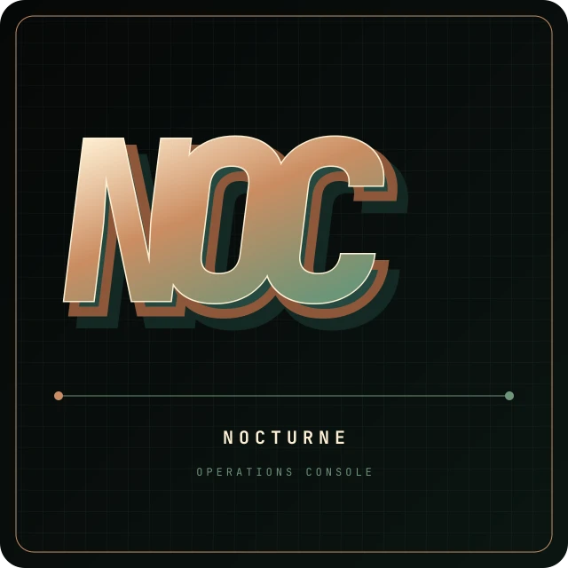

# NOC identity

**NOC** expands to **Nocturne Operations Console**. It also deliberately nods
to a network operations center: one compact place to observe and control a
live system.

The visual direction combines classic industrial control-room lettering,
1970s science-fiction hardware graphics and Nocturne's sharp terminal UI. It
avoids generic neon-city cyberpunk imagery so the project remains recognizable
at repository-banner, application-icon and terminal sizes.

## Assets

- `noc-banner.svg` — editable 1600×640 master for GitHub and project pages;
- `noc-mark.svg` — square monogram for avatars, releases and application art;
- `noc-mark.webp` — ready-to-upload square project avatar;
- `noc-terminal.txt` — grand framed terminal mark used by Fastfetch;
- `noc-terminal-compact.txt` — narrow split and small-terminal companion mark.

The ready-to-publish banner export lives at
`docs/screenshots/noc-banner.webp`.

`nocturne-banner` selects between the two terminal marks from the available
column width, follows the active accent and can append live node/session state
without a resident process. The text assets use Fastfetch's `$1`…`$6` color
placeholders, so the dimensional face, copper extrusion, phosphor shell and
live signal remain colorful without embedding terminal-specific escape codes.

Palette:

- void `#050708`
- phosphor `#6d9578`
- copper `#cb8d62`
- warm face `#fff0d4`

Keep the `NOC` face readable, preserve the diagonal extrusion and use
`JetBrains Mono ExtraBold` where available. Do not stretch, round or add a
glowing city backdrop to the mark.
