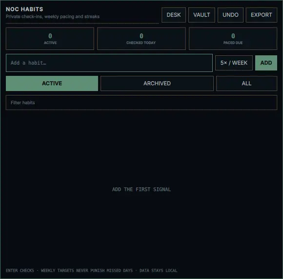
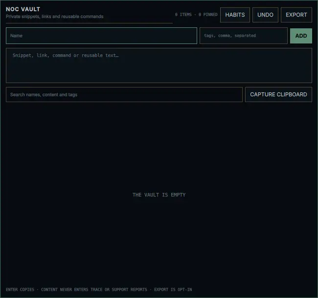

# Nocturne 1.0 // Fifty workflow upgrades

This release adds exactly fifty tested, local-first workflow capabilities. Habits and Vault are on-demand native cards: neither adds an idle daemon, and their content is excluded from Nocturne Trace and support reports.





1. A native NOC Habits panel matching the Nocturne shell.
2. A private `0600` local habit store.
3. Per-habit targets from one to seven checks per week.
4. One-click daily check-in toggles.
5. Live weekly completion counts.
6. Capped weekly progress percentages.
7. Calendar-day streak calculation.
8. A pacing engine that identifies habits due today.
9. A checked-today dashboard metric.
10. An active-habit dashboard metric.
11. Active, archived, and combined habit views.
12. Instant habit-name filtering.
13. Inline habit renaming.
14. Reversible habit archiving and restoration.
15. Two-step destructive deletion confirmation.
16. Swap-style undo for the latest habit mutation.
17. Private Markdown habit export.
18. Keyboard navigation and check-in actions.
19. Direct Habits access from Nocturne Settings and NOC Desk.
20. Zero persistent Habits processes while its card is closed.
21. A native NOC Vault panel matching the Nocturne shell.
22. A private `0600` local Vault store.
23. Named reusable text items.
24. Multiline snippet and command storage.
25. Normalized comma-separated tags.
26. Search across item names, content, and tags.
27. Pinned items sorted ahead of the rest.
28. Usage counters for copied Vault items.
29. Last-used timestamps for relevance sorting.
30. One-click Wayland clipboard copy.
31. Explicit clipboard-to-Vault capture.
32. Safe opening limited to single HTTP or HTTPS URLs.
33. Inline editing of names, content, and tags.
34. Two-step Vault deletion confirmation.
35. Swap-style undo for the latest Vault mutation.
36. Private Markdown Vault export.
37. Keyboard navigation and copy actions.
38. Direct Vault access from Nocturne Settings, Desk, and Habits.
39. Zero persistent Vault processes while its card is closed.
40. `++ habit` quick capture in Command Center.
41. `++3 habit` weekly-target shorthand in Command Center.
42. `:: name | content` private Vault capture in Command Center.
43. `note text` append-to-Desk shorthand in Command Center.
44. `copy text` clipboard shorthand in Command Center.
45. `open https://…` validated URL shorthand in Command Center.
46. Searchable Open NOC Habits launcher action.
47. Searchable Open NOC Vault launcher action.
48. Append-only Desk note support with the same undo and size limits.
49. Schema 7 migration plus privacy and zero-daemon doctor checks.
50. Automated UI, parser, state, clipboard, permission, undo, and export contracts.

## Command Center grammar

```text
+!^ ship release              high-priority Desk task due today
++3 exercise                  habit, three checks per week
:: deploy | https://host/     named private Vault item
note ask about the build      append to the Desk scratch note
copy ssh user@host            copy literal text
open https://example.com      open a validated web URL
```

All content actions are explicit. No user content is transmitted, indexed by a cloud service, or placed in diagnostic output.
