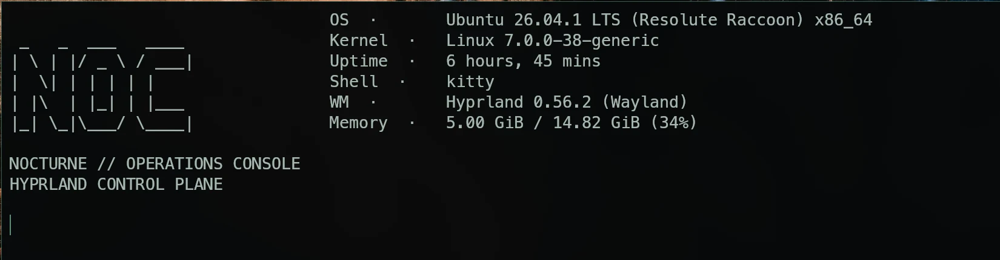
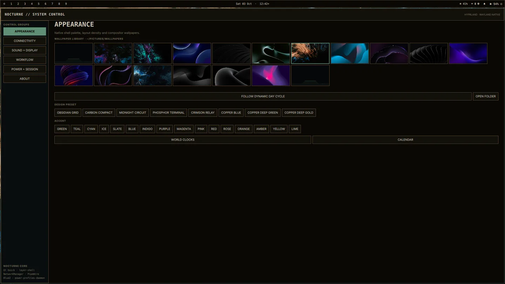
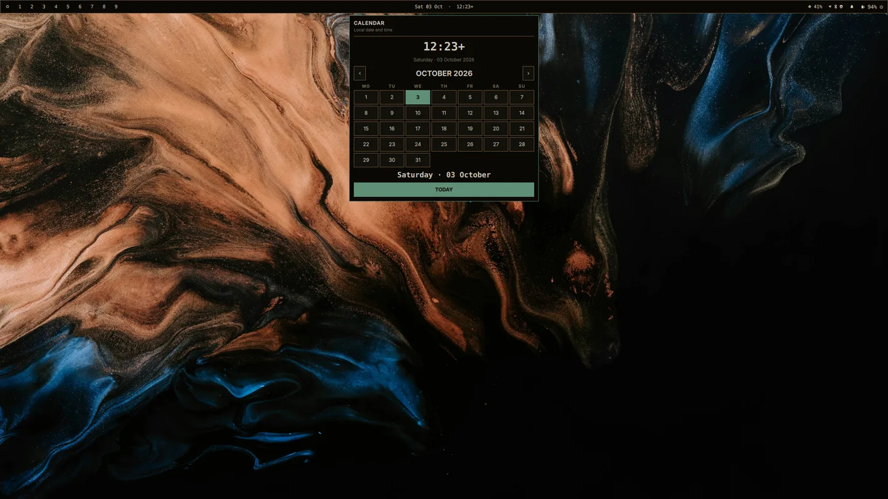
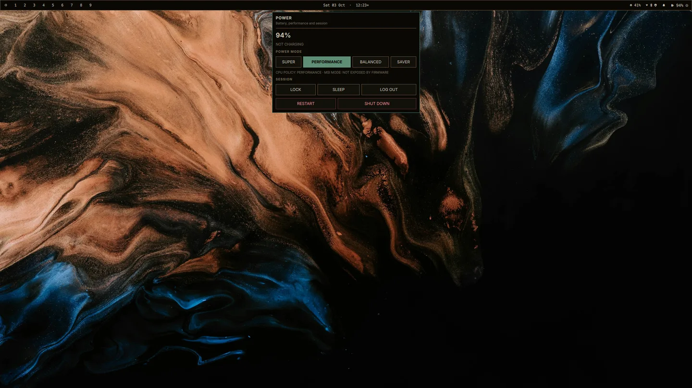
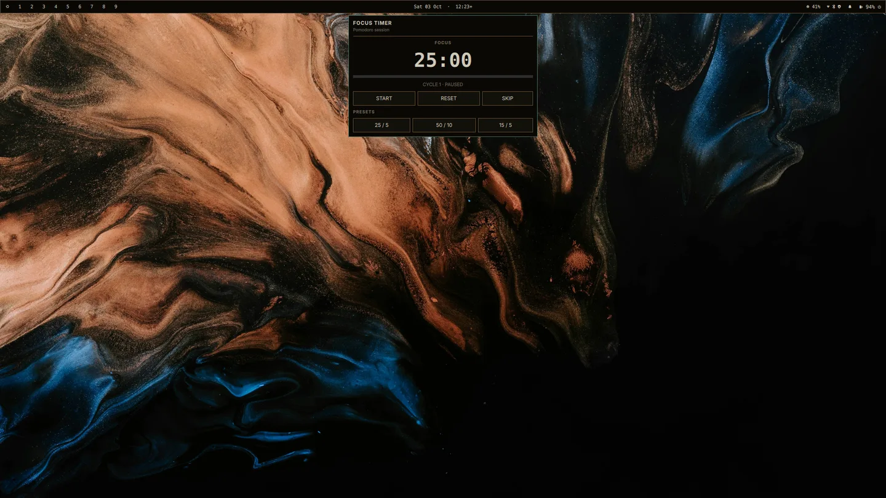
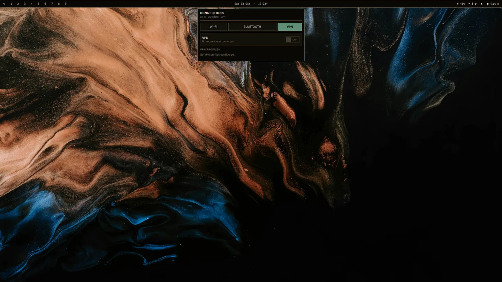
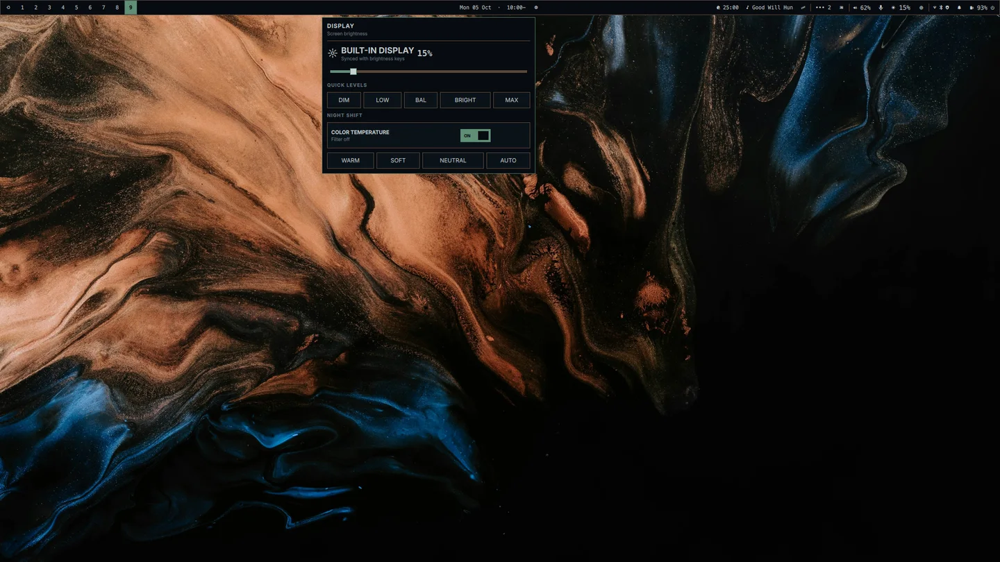
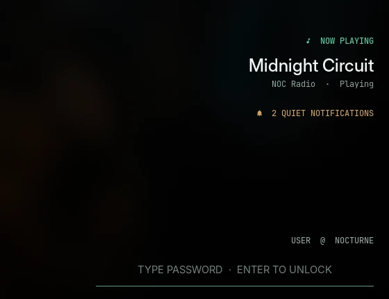

# Showcase

UI images below were captured from Nocturne 0.6.1–1.1.0 on an empty Hyprland
workspace on 5–6 October 2026, or from an isolated nested Hyprland session for
the lock screen. Browser windows, messages, clipboard content, account names,
Wi-Fi SSIDs and personal files are excluded. The NOC banner is editable
project artwork rather than a desktop screenshot.

## NOC identity

`NOC` means **Nocturne Operations Console** and nods to the classic network
operations center: one place to observe and control the live system.

## Terminal identity

The installer applies the compact mark to Fastfetch while keeping a plain-text
asset that works over SSH and in terminals without image-protocol support.

## Appearance control

Wallpaper previews, eight coordinated design presets and sixteen accents live
in the same settings surface.

## Launcher

The launcher starts only when requested, searches installed apps, running
windows and safe desktop actions, supports keyboard navigation and exits when
dismissed. `@` jumps directly to windows and `>` jumps to actions.

## Calendar

## Power and session

## Focus timer

## NOC Desk

Tasks, priorities, due views, focus targeting and quick notes live in one
on-demand native card. The screenshot uses a fresh private store and therefore
contains no task or note content.

## Connectivity

## Hardware-synchronized brightness

The dedicated sun/radiance glyph stays visually distinct from the adjacent
resource-dashboard chip. The slider follows hardware-key changes and scroll on
the bar still adjusts the real backlight.

## Efficiency Center

Memory pressure, proportional shell memory, startup health and grouped process
cost are sampled only while this page is open. Safe Cleanup is deliberately
limited to regenerable cache and retained user journals.

## Storage Center

Storage totals come from the live filesystem. Cleanup stays target-specific,
large duplicate discovery is explicitly requested, and the protected-data list
makes the safety boundary visible before an action.

## System Command

Meeting state, portal permissions, startup ownership, Guard and NOC Pulse share
one responsive page. The narrow capture demonstrates the single-column tiled
layout; wider windows use the same cards in two columns.

The screenshots use the Copper Deep Gold preset with the Emerald Silk
wallpaper. The same workflow and shortcuts remain available with every preset.

## Lock screen

These were rendered by Hyprlock inside an isolated nested Hyprland session.
Public demo values replace the owner's notifications, username and locations.
